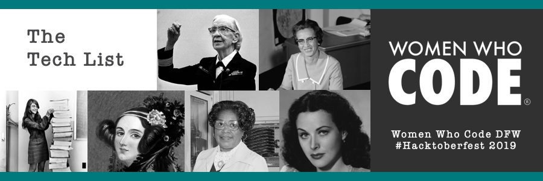

# The Tech List
Our Women Who Code DFW 2019 Hacktoberfest Project!

## Let's Recognize
The Tech List is a list of notable historical figures who have shaped the field of technology as it exists today, especially underrepresented or marginalized people.  

## Let's Collaborate
Anyone is free to contribute to this project! Be mindful of our [Code of Conduct.](https://www.womenwhocode.com/codeofconduct)

## Phase 1 - Building the Data Together
From October 1st to October 11th, we'll be accepting PRs into our data repository. This will be the data the underlies all Tech List projects. 

## Phase 2 - Competition
From October 11th to October 31st, we'll be breaking out into small groups (or you can fly solo!) to use this data to build independent projects. At the end of Hacktoberfest, qualifying projects will be entered into the WWC contest, and the winners will win a prize!
